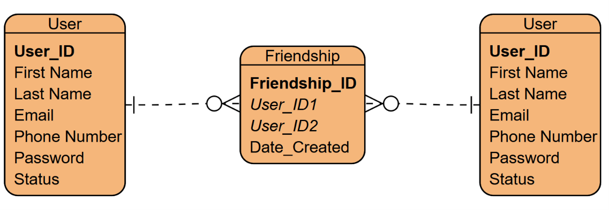

# Database Schema

The V1 ERD: 

## User

### Purpose

Stores information for registered users.

| Column | Data Type | Constraints | Description |
|---------|-----------|------------|-------------|
| User_ID | INT | Primary Key, Auto Increment | Unique identifier for each user |
| First_Name | VARCHAR(50) | NOT NULL | User's first name |
| Last_Name | VARCHAR(50) | NOT NULL | User's last name |
| Email | VARCHAR(255) | UNIQUE, NOT NULL | User's email address |
| Phone_Number | VARCHAR(20) | UNIQUE | User's phone number |
| Password | VARCHAR(255) | NOT NULL | Hashed user password |
| Status | BOOLEAN | NOT NULL | status (Busy/Free) |

### Primary Key

- `User_ID`

### Unique Keys

- `Email`
- `Phone_Number`

---

## Friendship

### Purpose

Stores friendship relationships between two users.

| Column | Data Type | Constraints | Description |
|---------|-----------|------------|-------------|
| Friendship_ID | INT | Primary Key, Auto Increment | Unique friendship identifier |
| User_ID1 | INT | Foreign Key | First user |
| User_ID2 | INT | Foreign Key | Second user |
| Date_Created | TIMESTAMP | NOT NULL | Date the friendship was created |

### Primary Key

- `Friendship_ID`

### Foreign Keys

| Column | References |
|---------|------------|
| User_ID1 | User(User_ID) |
| User_ID2 | User(User_ID) |

---

# Data Dictionary

## User

| Attribute | Description |
|-----------|-------------|
| User_ID | Unique user identifier |
| First_Name | User's first name |
| Last_Name | User's last name |
| Email | User login email |
| Phone_Number | User contact number |
| Password | Securely hashed password |
| Status | Indicates account is status|

---

## Friendship

| Attribute | Description |
|-----------|-------------|
| Friendship_ID | Unique friendship identifier |
| User_ID1 | First user in the friendship |
| User_ID2 | Second user in the friendship |
| Date_Created | Timestamp when the friendship was created |

---
# Business Rules

- Users must register with a unique email address.
- Phone numbers are optional but must be unique if provided.
- Users cannot be friends with themselves.
- Each friendship must involve exactly two users.
- Duplicate friendships are not allowed.
- Friendships are mutual (bidirectional).
- A user may have zero or more friends.

---
# Assumptions
- Email addresses are used for user authentication.
- Passwords are stored using a secure hashing algorithm 
