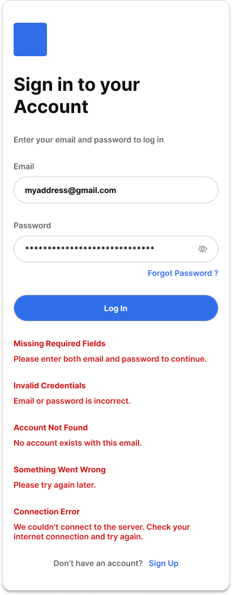
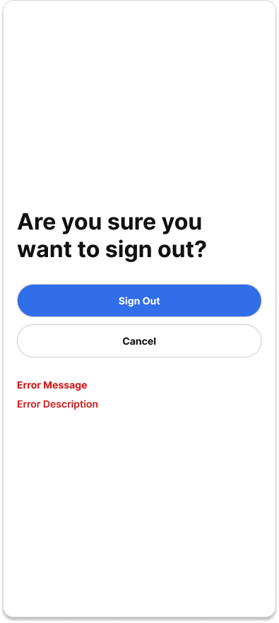
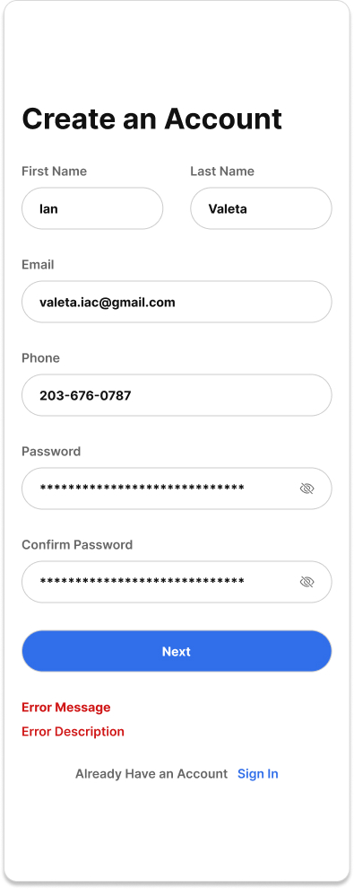
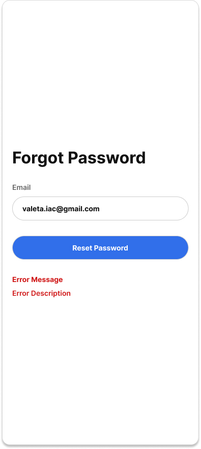
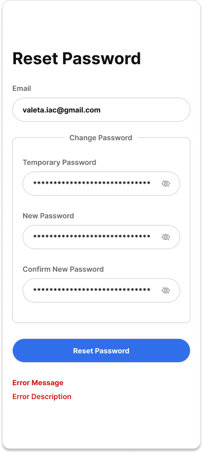
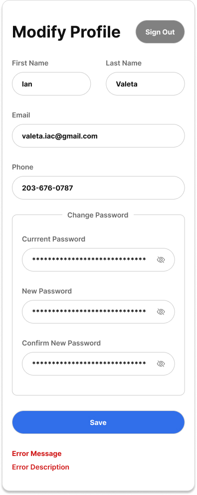
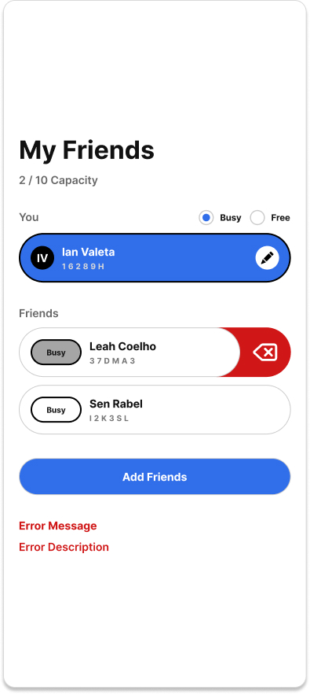
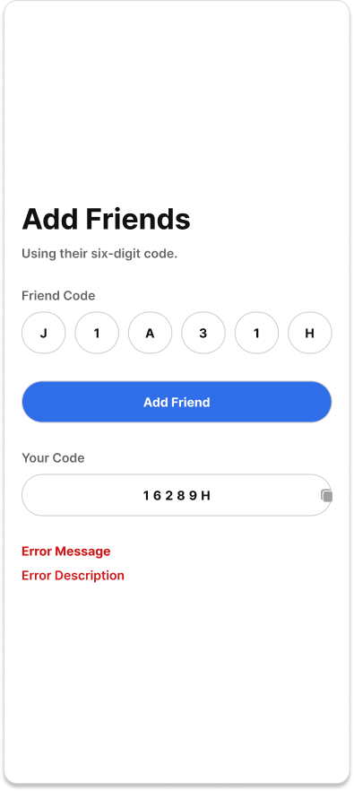
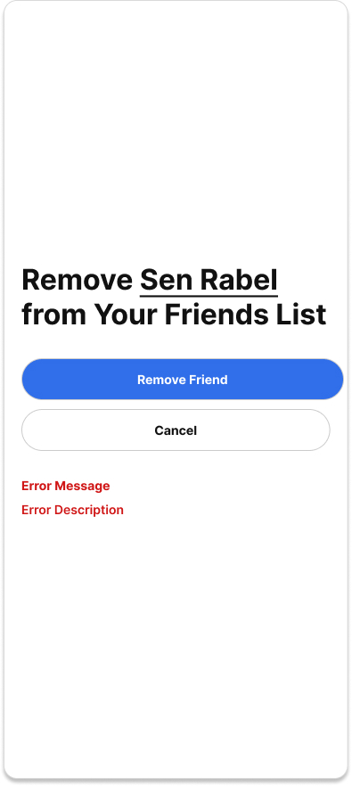

# Frontend Documentation

## Table of Contents

- [Error Handling](#error-handling)
- [Folder Structure](#folder-structure)
- [Routing](#routing)
- [Authentication Flow](#authentication-flow)
- [Session Management](#session-management)
- [Loading States](#loading-states)
- [Form Validation](#form-validation)
- [User Flow](#user-flow)
  - [Create Account](#create-account)
  - [Sign In](#sign-in)
  - [Forgot Password](#forgot-password)
  - [Reset Password](#reset-password)
  - [Modify Profile](#modify-profile)
  - [Delete Account](#delete-account)
  - [Friends List](#friends-list)
  - [Add Friend](#add-friend)
  - [Remove Friend](#remove-friend)

## Web Application

Domain:

```
https://app.alloooo.com
```

Purpose:

- User authentication
- Friend management
- Status management
- Profile management

All authenticated requests communicate with

```
https://api.alloooo.com/v1
```

Each endpoint should have its own function.

Example

```
api/

    auth.ts
    users.ts
    friends.ts
    sessions.ts
```

Example

```ts
login();

logout();

getCurrentUser();

...
```

# Error Handling

Every API response returns

```ts
{
  (error, data);
}
```

If

```
error !== null
```

Display the error message returned by the API.

# Folder Structure

```
src/
├── assets/ # Static assets like images, fonts, and icons
│   ├── fonts/ # Custom TTF/OTF files are stored here
│   ├── icons/ # SVG/PNG icons for the application
│   └── images/ # All image assets (e.g., screenshots, logos)
├── components/ # Reusable UI components (e.g., buttons, cards, modals)
├── pages/ # Page-level components (e.g., SignIn, FriendsList)
├── hooks/ # Custom React hooks for state management and logic
│   ├── api/ # API-related hooks (e.g., data fetching, mutations)
│   ├── auth/ # Authentication-related hooks (e.g., login, logout)
│   └── ui/ # UI-related hooks (e.g., form validation, animations)
├── styles/ # Global styles, themes, and CSS modules
├── types/ # TypeScript type definitions
│   ├── api/ # API response and request types
│   ├── models/ # Domain-specific models (e.g., User, Friend)
│   └── shared/ # Shared types used across the application
└── utils/ # Utility functions and helpers
```

# Routing

| Route            | Page (Component) | Access Type |
| ---------------- | ---------------- | ----------- |
| /                | Sign In          | Public      |
| /create-account  | Create Account   | Public      |
| /forgot-password | Forgot Password  | Public      |
| /reset-password  | Reset Password   | Public      |
| /                | Friends List     | Protected   |
| /modify-profile  | Modify Profile   | Protected   |
| /add-friend      | Add Friend       | Protected   |
| /remove-friend   | Remove Friend    | Protected   |
| /sign-out        | Sign Out         | Protected   |

**Note:** Unauthenticated users attempting to access protected routes should be redirected to `/`
(sign in)

# Authentication Flow

## Application Startup

When the application loads:

```
GET /auth/me
```

Possible outcomes:

| Authenticated                 | Unauthenticated     |
| ----------------------------- | ------------------- |
| ↓ Load user data & auth token | Redirect to Sign In |
| ↓ Navigate to Friends List    | ...                 |

## Sign In



**Description:** The sign-in page allows users to authenticate using their credentials.

**API Call:**

```
POST /auth/login
```

**Details:** See [Sign In Feature Documentation](../features/authentication/sign-in.md) for UI requirements, validation rules, and user flows.

Successful login:

- Session cookie stored by browser
- Refresh authenticated user
- Navigate to Friends List

## Sign Out



**Description:** The sign-out page allows users to log out of their account.

**API Call:**

```
POST /auth/logout
```

**Details:** See [Sign Out Feature Documentation](../features/authentication/sign-out.md) for UI requirements, validation rules, and user flows.

Then

- Clear cached user data
- Redirect to Sign In

# Session Management

Authentication should rely on the secure HTTP cookie sent to the server to validate with active sessions.

The browser automatically sends:

```
Cookie:
session_token=...
```

Include credentials on every authenticated request.

**Example:**

```ts
fetch(url, {
  credentials: "include",
});
```

**Related Documentation:**

- [Session Entity in Database](database.md#Session) for database schema details.
- [Session API Endpoints in API Documentation](api.md#Session) for API interactions.

# Global Authentication State

The frontend must maintain an `AuthState` interface to track authentication status globally:

```ts
interface AuthState {
  authenticated: boolean; // Whether the user is authenticated
  loading: boolean; // Whether authentication is in progress
  userId?: string; // Optional user ID if authenticated
}
```

Protected routes should:

1. Check authentication state
2. Show loading indicator while verifying session
3. Redirect unauthenticated users
4. Render requested page for authenticated users

Authentication state is derived **exclusively** from the API response to:

```
GET /auth/me
```

**Note:** Avoid storing sensitive data (e.g., tokens, passwords) in the frontend. Use HTTP-only cookies for session management.

# Loading States

Every request should provide:

- a preview skeleton
- disabled submit buttons

Each page should support:

- Initial loading
- Empty state
- Success state
- Validation errors
- API errors
- Network errors

# Form Validation

Client-side validation should match backend validation to avoid bugs.

# User Flow

## Create Account



**App Page:** See [Account API Documentation](api.md#Account) for related API details.

**API Call:**

```
POST /auth/register
```

**Details:** See [Create Account Feature Documentation](../features/authentication/create-account.md) for UI requirements, validation rules, and user flows.

**On Success:**

- Display confirmation message.
- Redirect to Sign In.

**On Failure:**

- Display error message from the API.
- Allow user to retry.

## Sign In


**App Page:** See [Account API Documentation](api.md#Account) for related API details.

**API Call:**

```
POST /auth/login
```

**Details:** See [Sign In Feature Documentation](../features/authentication/sign-in.md) for UI requirements, validation rules, and user flows.

**On Success:**

- Load authenticated user.
- Navigate to Friends List.

**On Failure:**

- Display error message from the API.
- Allow user to retry.

## Forgot Password



**App Page:** See [Account API Documentation](api.md#Account) for related API details.

**Description:** The forgot password page allows users to request a password reset.

**API Call:**

```
POST /auth/forgot-password
```

**Details:** See [Forgot Password Feature Documentation](../features/authentication/forgot-password.md) for UI requirements, validation rules, and user flows.

**On Success:**

- Display confirmation message.
- Redirect to Sign In.

**On Failure:**

- Display error message from the API.
- Allow user to retry.

**Note:** Display confirmation regardless of whether the email exists.

## Reset Password



**App Page:** See [Account API Documentation](api.md#Account) for related API details.

**Description:** The reset password page allows users to set a new password after requesting a reset.

**API Call:**

```
POST /auth/reset-password
```

**Details:** See [Reset Password Feature Documentation](../features/authentication/forgot-password.md) for UI requirements, validation rules, and user flows.

**On Success:**

- Display confirmation message.
- Redirect to Sign In.

**On Failure:**

- Display error message from the API.
- Allow user to retry.

## Modify Profile



**App Page:** See [User API Documentation](api.md#User) for related API details.

**Description:** The modify profile page allows users to update their profile information.

**API Calls:**

```
GET /users/me
PATCH /users/me
```

**Details:** See [Modify Profile Feature Documentation](../features/profile/modify-profile.md) for UI requirements, validation rules, and user flows.

**On Success:**

- Display confirmation message.
- Refresh profile data.

**On Failure:**

- Display error message from the API.
- Allow user to retry.

## Delete Account

**App Page:** See [User API Documentation](api.md#User) for related API details.

**Description:** From Modify Profile

**API Call:**

```
DELETE /users/me
```

**Details:** See [Modify Profile Feature Documentation](../features/profile/modify-profile.md) for UI requirements, validation rules, and user flows.

**On Success:**

- Redirect to Sign In.

**On Failure:**

- Display error message from the API.
- Allow user to retry.

# Friends

## Friends List



**App Page:** See [Friends API Documentation](api.md#Friends) for related API details.

**Description:** The friends list displays all friends and their statuses.

**API Call:**

```
GET /friends
```

**Details:** See [Friends List Feature Documentation](../features/friends-list/view-friends-list.md) for UI requirements, validation rules, and user flows.

**On Success:**

- Display friends list.

**On Failure:**

- Display error message from the API.
- Allow user to retry.

Display

- Name
- Email
- Busy status

## Add Friend



**App Page:** See [Friends API Documentation](api.md#Friends) for related API details.

**Description:** The add friend page allows users to invite others to their friends list.

**API Call:**

```
POST /friends/:friend-id
```

**Details:** See [Add Friend Feature Documentation](../features/friends-list/add-friend.md) for UI requirements, validation rules, and user flows.

**On Success:**

- Refresh friends list.

**On Failure:**

- Display error message from the API.
- Allow user to retry.

## Remove Friend



**App Page:** See [Friends API Documentation](api.md#Friends) for related API details.

**Description:** The remove friend page allows users to remove others from their friends list.

**API Call:**

```
DELETE /friends/:friend-id
```

**Details:** See [Remove Friend Feature Documentation](../features/friends-list/remove-friend.md) for UI requirements, validation rules, and user flows.

**On Success:**

- Refresh friends list.

**On Failure:**

- Display error message from the API.
- Allow user to retry.
