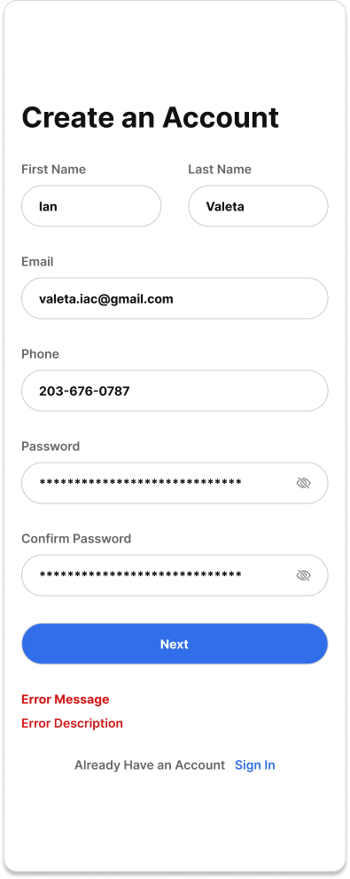

# User Story

As a user, I want to create an account so that I can securely access the app.

**Acceptance Criteria**

**Scenario 1: Successful account creation**

* Given I have entered a valid name, email, phone number, password, and age
* When I submit the Create Account form
* Then my account is created
* And I am signed in
* And my information is stored securely

**Scenario 2: Missing required fields**

* Given one or more required fields are empty
* When I submit the Create Account form
* Then the account is not created
* And I see the message:

  > **Missing Required Fields**
  > Please enter all required fields to continue.

**Scenario 3: Duplicate email**

* Given an account already exists with my email address
* When I submit the Create Account form
* Then the account is not created
* And I receive an HTTP 409 Conflict response
* And I see the message:

  > **Duplicate Email**
  > Someone has already created an account with that email. Use a different email.

**Scenario 4: Invalid email**

* Given I submit an improperly formatted email
* When I submit the Create Account form
* Then the account is not created
* And I see the message:

  > **Invalid Email**
  > Please enter a valid email address.

**Scenario 5: Duplicate phone number**

* Given an account already exists with my phone number
* When I submit the Create Account form
* Then the account is not created
* And I receive an HTTP 409 Conflict response
* And I see the message:

  > **Duplicate Phone Number**
  > Someone has already created an account with that phone number. Use a different phone number.

**Scenario 6: Invalid Phone Number**

* Given I submit a phone number with less than 10 digits or with non numeric characters
* When I submit the Create Account form
* Then the account is not created
* And I see the message:

  > **Invalid Email**
  > Please enter a valid phone number

**Scenario 7: Password does not meet requirements**

* Given I have entered a password that does not meet one or more password requirements
* When I submit the Create Account form
* Then my account is not created
* And I receive an HTTP 400 Bad Request response
* And I see the message:

> **Password Requirements Not Met**
> Your password must:
>
> * Be 8–128 characters long (12+ recommended)
> * Include at least one uppercase letter
> * Include at least one lowercase letter
> * Include at least one number
> * Include at least one special character (! @ # $ % ^ & * - _ ?)
> * Not contain spaces
> * Not be a commonly used or compromised password

**Scenario 8: Passwords do not match**

* Given I am on the Create Account form
* And I have entered a password and a password confirmation field
* When the password and confirmation do not match
* And I submit the Create Account form
* Then the account is not created
* And I receive an HTTP 400 Bad Request response
* And I see the message:

> **Passwords Do Not Match**
> Please make sure both passwords match before continuing.

**Scenario 9: Server error**

* Given I have entered valid account information
* When I submit the Create Account form
* And the server encounters an internal error
* Then my account is not created
* And I receive an HTTP 500 Internal Server Error response
* And I see the message:

  > **Something Went Wrong**
  > We couldn't create your account right now. Please try again later.

**Scenario 10: Connection error**

* Given I have entered valid account information
* When I submit the Create Account form
* And the client cannot connect to the server (for example, because I am offline or the server is unreachable)
* Then my account is not created
* And I see the message:

  > **Connection Error**
  > We couldn't connect to the server. Check your internet connection and try again.

**Scenario 11: Terms of Service and Privacy Policy Acceptance**

* Given I am on the Create Account form
* When I do not check or accept the Terms of Service and Privacy Policy
* And I submit the Create Account form
* Then the account is not created
* And I receive an HTTP 400 Bad Request response
* And I see the error message:

> **Acceptance Required**
> You must accept the Terms of Service and Privacy Policy to continue.

**Technical Requirements**
* Passwords are transmitted over HTTPS and are never stored or logged in plain text.
* Passwords are hashed using a secure one-way hashing algorithm (e.g., Argon2id, bcrypt, or scrypt) before being stored.
* Name: Required, 1–100 characters.
* Email: Required, 3–254 characters. Must be a valid email address. Trimmed and converted to lowercase before validation and storage.
* Phone Number: Required, 10–15 digits after normalization. Stored in normalized E.164 format when possible.
* Password: Required, 8–128 characters (12+ recommended), at least one uppercase letter, one lowercase letter, one number, one special character (! @ # $ % ^ & * - _ ?), no spaces, and must not be a commonly used or compromised password.
* The API endpoint is `POST /api/user`.
* The client sends a JSON request containing `name`, `email`, `phone`, `password`, and `age`.
* A successful account creation returns **HTTP 201 Created**.
* Invalid client input returns **HTTP 400 Bad Request**.
* Duplicate email or phone number returns **HTTP 409 Conflict**.
* Unexpected server failures return **HTTP 500 Internal Server Error**.
* If the client cannot reach the server (e.g., offline, network failure, or timeout), the client displays a connection error and does not create an account.
