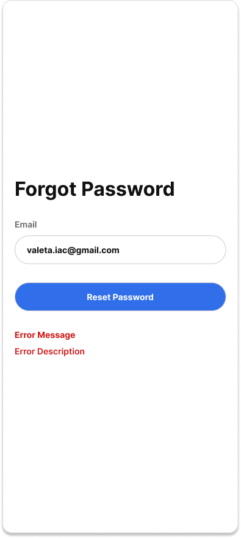
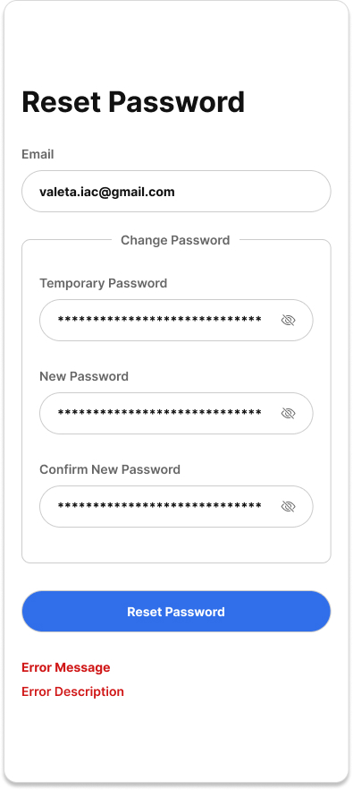

# User Story

As a user, I want to reset my password if I forget it so that I can regain access to my account securely.

**Acceptance Criteria**
**Scenario 1: Successfully request a temporary password**

- **Given** I am not logged in and have hit the forgot password link

- **When** I enter my email and press submit

- **Then** a temporary password is generated

- **And** the temporary password is sent to my registered email address

- **And** I see the message:

  > **Temporary Password Sent**
  > If an account exists for that email address, a temporary password has been sent. Please check your email.

**Scenario 2: Successfully reset password**

- **Given** I have received a valid temporary password

- **And** I have entered the temporary password

- **And** I have entered a new password

- **And** the Confirm Password field matches the new password

- **When** I submit the Reset Password form

- **Then** my password is updated

- **And** the temporary password is overwritten

- **And** I am redirected to the Sign In page

- **And** I see the message:

  > **Password Reset Successful**
  > Your password has been reset successfully. Please sign in using your new password.

**Scenario 3: Missing required fields**

- **Given** one or more required fields (Temporary Password, New Password, or Confirm Password) are empty

- **When** I submit the Reset Password form

- **Then** my password is not updated

- **And** I see the message:

  > **Missing Required Fields**
  > Please complete all required fields to continue.
  
**Scenario 4: Temporary password is invalid or expired**

- **Given** I enter an invalid or expired temporary password

- **When** I submit the Reset Password form

- **Then** my password is not updated

- **And** I receive an HTTP 400 Bad Request response

- **And** I see the message:

  > **Invalid Temporary Password**
  > The temporary password is invalid or has expired. Please request a new temporary password.

**Scenario 5: Passwords do not match**

- **Given** I have entered a new password

- **And** the Confirm Password does not match

- **When** I submit the Reset Password form

- **Then** my password is not updated

- **And** I see the message:

  > **Passwords Do Not Match**
  > Your new password and confirmation password must match.

**Scenario 6: Server error**

- **Given** I have entered valid reset information

- **When** I submit the Reset Password form

- **And** the server encounters an internal error

- **Then** my password is not updated

- **And** I receive an HTTP 500 Internal Server Error response

- **And** I see the message:

  > **Something Went Wrong**
  > We couldn't reset your password right now. Please try again later.

**Scenario 7: Connection error**

- **Given** I have entered valid reset information

- **When** I submit the Reset Password form

- **And** the client cannot connect to the server

- **Then** my password is not updated

- **And** I see the message:

  > **Something Went Wrong**
  > We couldn't connect to the server. Check your internet connection and try again.

**Scenario 8: Invalid email format**

* Given I am on the Forgot Password page
* When I enter an improperly formatted email address
* And I submit the form
* Then no request is sent to the server
* And I see the message:

  > **Invalid Email**
  > Please enter a valid email address.

**Scenario 9: Wrong email (no account exists)**

* Given I am not logged in
* When I enter an email that is not associated with any account
* And I submit the Forgot Password form
* Then no account is identified
* And I see the message:

  > **Wrong Email**
  > No account is associated with that email address.

**Scenario 10: Invalid email format**

* Given I am on the Reset Password page
* When I enter an improperly formatted email address
* And I submit the form
* Then no request is processed
* And I see the message:

  > **Invalid Email**
  > Please enter a valid email address.

**Scenario 11: Wrong email**

* Given I enter an email with no associated account
* When I attempt to proceed with password reset
* Then the reset flow is blocked
* And I see the message:

  > **Wrong Email**
  > No account is associated with that email address.

**Technical Requirements**
- The Forgot Password page contains a required Email field.
- Email addresses are trimmed and converted to lowercase before validation.
- The client sends a POST request to /api/user/forgot-password containing the user's email.
- If the email exists, the server generates a cryptographically secure temporary password (or temporary credential) with a configurable expiration time (e.g., 15 minutes).
- The temporary password is sent only to the user's registered email address.
- For security, the Forgot Password endpoint returns the same success message regardless of whether the email exists to prevent brute forcing.
- The Reset Password page contains the following required fields:
  - Temporary Password
  - New Password
  - Confirm Password
- The client sends a POST request to /api/user/reset-password containing the temporary password, new password, and confirmation password.
- Passwords are transmitted over HTTPS.
- Passwords are never stored or logged in plain text.
- Passwords are hashed using a secure hashing algorithm before storage.
- Temporary passwords are overwritten after a successful password reset.
- A successful password reset redirects the user to the Sign In page.
- Successful password reset returns HTTP 200 OK.
- Invalid client input or expired/invalid temporary password returns HTTP 400 Bad Request.
- Unexpected server failures return HTTP 500 Internal Server Error.
- If the client cannot reach the server the client displays a connection error and the password is not reset. 