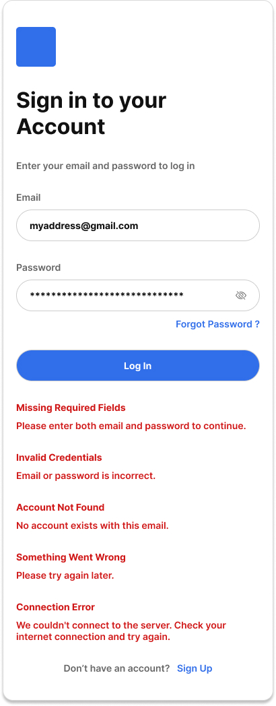

# User Story

As a user, I want to sign in to my account so that I can access my profile and app features securely.

**Acceptance Criteria**

**Scenario 1: Successful sign in**

* Given I have a valid email and password
* When I submit the Sign In form
* Then I am authenticated
* And I am redirected to the main application
* And a secure session is created for my account

**Scenario 2: Missing required fields**

* Given one or both fields (email or password) are empty
* When I submit the Sign In form
* Then I am not signed in
* And I see the message:

  > **Missing Required Fields**
  > Please enter both email and password to continue.

**Scenario 3: Invalid credentials**

* Given I enter an email and password that do not match an existing account
* When I submit the Sign In form
* Then I am not signed in
* And I receive an HTTP 401 Unauthorized response
* And I see the message:

  > **Invalid Credentials**
  > Email or password is incorrect.

**Scenario 4: Unregistered email**

* Given I enter an email that is not associated with any account
* When I submit the Sign In form
* Then I am not signed in
* And I receive an HTTP 401 Unauthorized response
* And I see the message:

  > **Account Not Found**
  > No account exists with this email.

**Scenario 5: Server error**

* Given I have entered valid credentials
* When I submit the Sign In form
* And the server encounters an internal error
* Then I am not signed in
* And I receive an HTTP 500 Internal Server Error response
* And I see the message:

  > **Something Went Wrong**
  > Please try again later.

**Scenario 6: Connection error**

* Given I have entered valid credentials
* When I submit the Sign In form
* And the client cannot reach the server
* Then I am not signed in
* And I see the message:

  > **Connection Error**
  > We couldn't connect to the server. Check your internet connection and try again.

**Technical Requirements**

* The API endpoint is `POST /api/auth/login`.
* The client sends a JSON request containing `email` and `password`.
* Email is trimmed and converted to lowercase before submission.
* Password is transmitted securely over HTTPS and never stored or logged in plain text.
* Password verification is performed using a secure hash comparison (e.g., Argon2id, bcrypt, or scrypt).
* A successful sign in returns **HTTP 200 OK** and issues a secure session (e.g., JWT or HTTP-only cookie).
* Invalid credentials return **HTTP 401 Unauthorized**.
* Server errors return **HTTP 500 Internal Server Error**.
* Connection failures (offline, timeout, unreachable server) are handled client-side with a connection error state.
* Sessions must be securely stored and invalidated on sign out.
