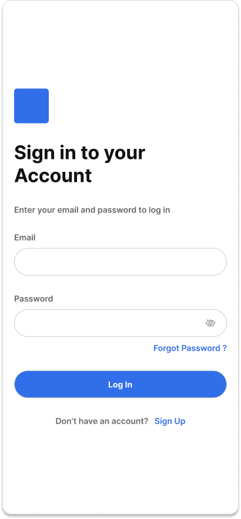

# User Story

As a user, I want to sign out of my account so that my session is securely ended and my account is protected.

**Acceptance Criteria**

**Scenario 1: Successful sign out**

* Given I am signed in
* When I click the Sign Out action
* Then my session is terminated
* And I am redirected to the sign-in page
* And I can no longer access authenticated routes without signing in again

**Scenario 2: No active session**

* Given I am not signed in
* When I attempt to access the Sign Out action or endpoint
* Then no session is terminated
* And I am redirected to the sign-in page

**Scenario 3: Server-side sign out success (if applicable)**

* Given I am signed in
* When I trigger sign out
* Then the server invalidates my session token or refresh token
* And I receive an HTTP 200 OK response

**Scenario 4: Server error during sign out**

* Given I am signed in
* When I attempt to sign out
* And the server encounters an internal error
* Then my client session is cleared locally (fallback)
* And I am still signed out on the client
* And I see the message:

  > **Sign Out Issue**
  > We signed you out locally, but there was a problem clearing your session on the server.

**Scenario 5: Connection error**

* Given I am signed in
* When I attempt to sign out
* And the client cannot reach the server
* Then my local session is cleared
* And I am signed out on the client
* And I am redirected to the sign-in page

**Technical Requirements**

* The API endpoint is `POST /api/auth/logout` (if server-managed sessions are used).
* Sign out clears authentication state on both client and server (when applicable).
* Authentication tokens (JWT or session cookies) are invalidated or removed.
* HTTP-only cookies must be cleared on logout.
* Client-side authentication state must be reset immediately upon sign out.
* A successful server sign out returns **HTTP 200 OK**.
* Server errors return **HTTP 500 Internal Server Error**.
* Connection failures are handled client-side with graceful fallback sign out (local session removal).
* After sign out, all protected routes must require re-authentication.
