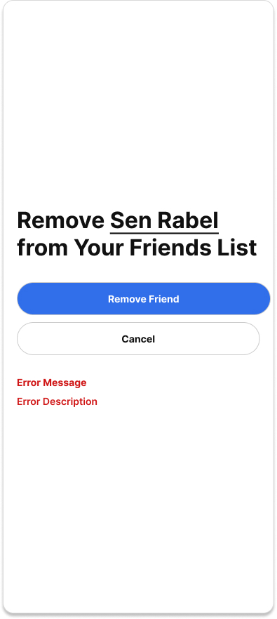

# User Story

As a user, I want to remove a friend so that I can keep my friends list up to date.

**Acceptance Criteria**

**Scenario 1: Successful friend removal**

- **Given** I am logged in 
- **And** the user is on my friends list
- **When** I choose to remove the friend and confirm the action
- **Then** the friend is removed from my friends list 
- **And** I no longer see their status 
- **And** they no longer see my status 
- **And** I receive an HTTP 200 response

**Scenario 2: Friend not found**

- **Given** I am logged in 
- **And** the specified user is not on my friends list
- **When** I attempt to remove the friend
- **Then** no changes are made to my friends list 
- **And** I receive an HTTP 404 Not Found response
- **And** I see the message:

  > **Friend Not Found**
  > The selected user is not on your friends list.
  
**Scenario 3: Server error during friend removal**

- **Given** I am logged in 
- **And** the selected user is on my friends list
- **When** the server encounters an internal error while processing the request
- **Then** the friend is not removed and I receive an HTTP 500 Internal Server Error response
- **And** I see the message:

  > **Something Went Wrong**
  > We couldn't remove your friend right now. Please try again later.

**Scenario 4: Connection error**

- **Given** I am logged in 
- **And** the selected user is on my friends list
- **When** the client cannot connect to the server 
- **Then** the friend is not removed
- **And** I see the message:

  > **Connection Error**
  > We couldn't connect to the server. Check your internet connection and try again.

**Technical Requirements:**
- The API endpoint is DELETE /api/user/friends/{friendId}.
- The client sends the unique identifier of the friend to remove.
- The system verifies that the friendship exists before removing it.
- Removing a friend deletes the friendship relationship in the database.
- Once removed, neither user appears in the other's friends list
- Successful removal returns HTTP 200 
- Attempting to remove a user who is not a friend returns HTTP 404 Not Found.
- Unexpected server failures return HTTP 500 Internal Server Error.
- If the client cannot reach the server the client displays a connection error and does not remove the friend.