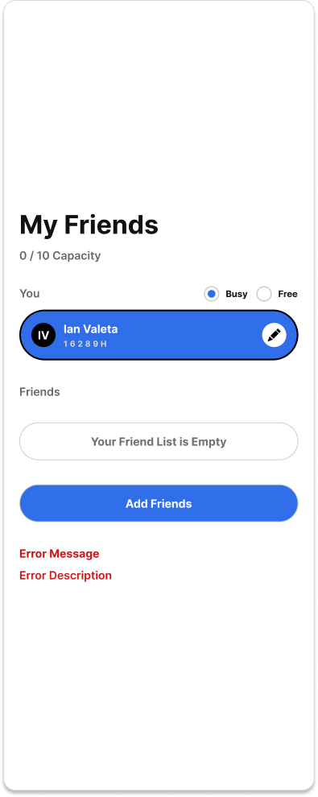
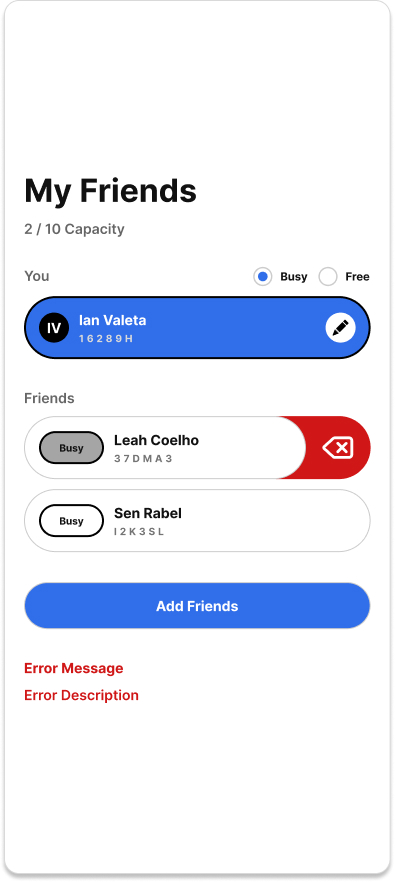

# User Story

As a user, I want to view my friends list so that I can see their current availability and decide when to reach out.

**Acceptance Criteria**

**Scenario 1: Empty friends list**

* Given I have no friends added to my account
* When I open the Friends List
* Then I see an empty state message indicating no friends are available
* And I am prompted to add friends

**Scenario 2: Friends list with data**

* Given I have one or more friends in my friends list
* When I open the Friends List
* Then I see a list of all my friends
* And each friend displays their name (login info) and current status (e.g., Busy, Open to Text, Open to Hang)

**Scenario 3: Status updates reflected**

* Given a friend updates their status
* When I refresh or reopen the Friends List
* Then I see the updated status reflected for that friend

**Scenario 4: Partial data handling**

* Given a friend exists but has no current status set
* When I view the Friends List
* Then that friend is still displayed
* And their status shows as “Unknown”
Here are the added acceptance criteria scenarios for connection and server errors:

**Scenario 5: Connection error**

* **Given** I am logged in
* **When** I open the Friends List
* **And** the client cannot connect to the server (for example, because I am offline or the server is unreachable)
* **Then** my Friends List is not loaded
* **And** I see the message:

  > **Connection Error**
  > We couldn't connect to the server. Check your internet connection and try again.

**Scenario 6: Server error while loading Friends List**

* **Given** I am logged in
* **When** I open the Friends List
* **And** I encounter a server error
* **Then** my Friends List is not loaded
* **And** I receive an HTTP 500 Internal Server Error response
* **And** I see the message:

  > **Something Went Wrong**
  > We couldn't load your Friends List right now. Please try again later.
  
**Technical Requirements:**
* Friend data includes: login identifier (name/email/phone depending on design) and current status.
* Status values are predefined (e.g., Busy, Open to Text, Open to Hang, Open to Call).
* List should reflect real-time or near-real-time updates when possible.
* Access is limited to authenticated users only.
* Cap of 10 Friends
* Use WebSockets to maintain realtime data sync